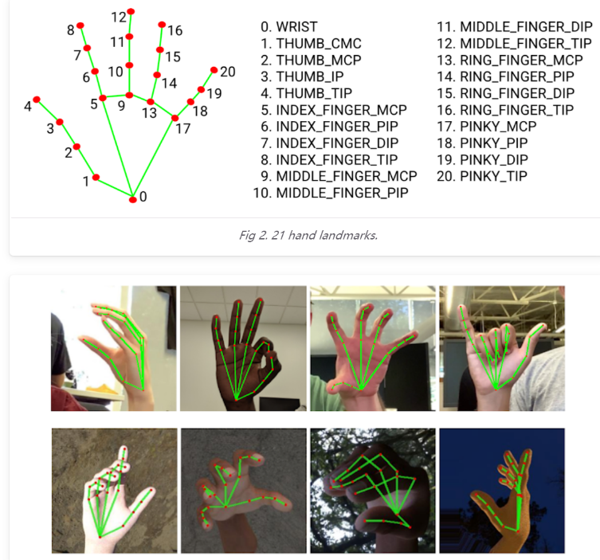
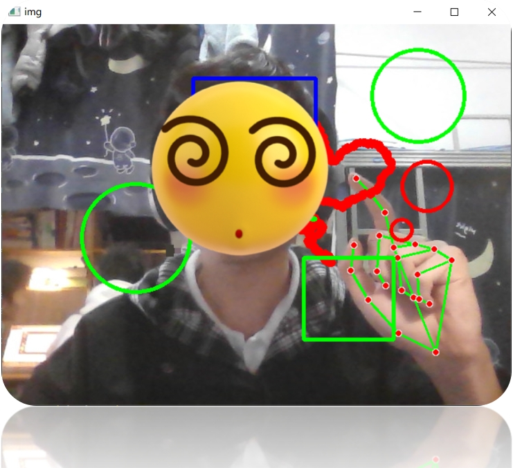

## 主要功能

- [x] 人脸识别

- [x] 口罩检测

- [x] 悬空绘画

## 手部关键点示意图

## 运行效果

## 其他

权重文件下载

​	链接：https://pan.baidu.com/s/1JlrmstHq2_gU9gbDCA4Q6A?pwd=k8jp 
​	提取码：k8jp

FaceNet论文原地址：https://arxiv.org/abs/1503.03832